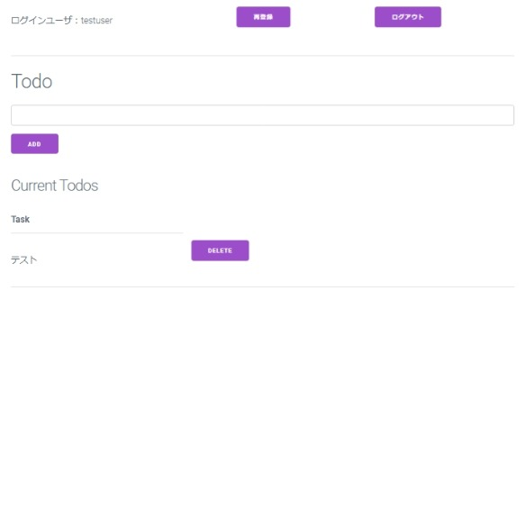
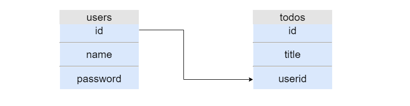
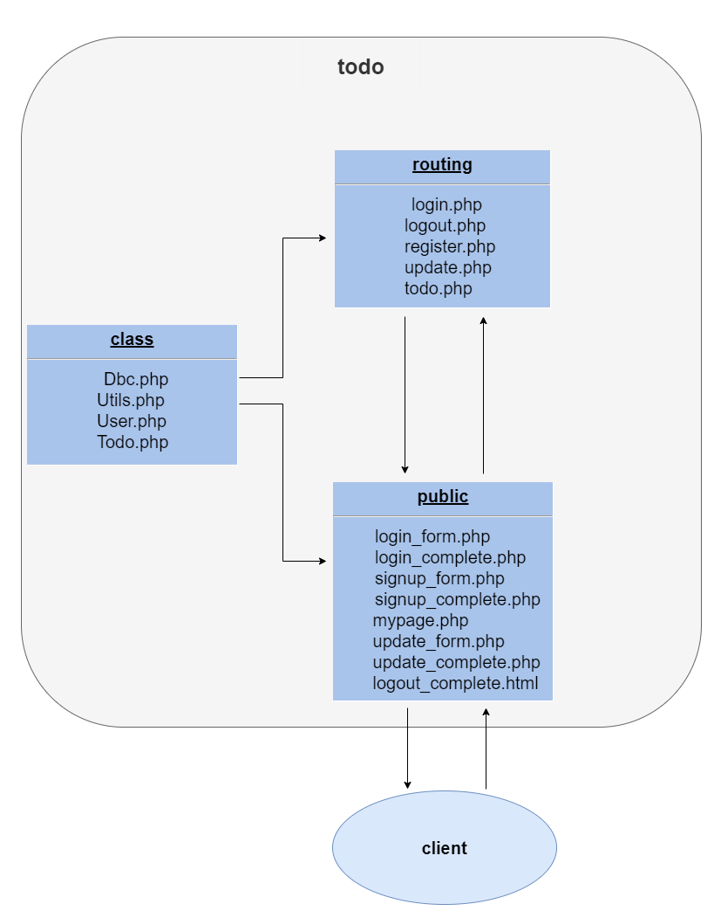

### Todoアプリ
---


#### 作成した目的
---
* phpとwebアプリ開発(特にサーバーサイド)について理解する

#### 主な特徴
---
* フレームワークなしでの実装
* 簡単なログイン機能（再登録機能も実装）
* ユーザ名の重複排除
* 一度ログインすると、ログアウトするかセッションが切れるまでログイン状態を保持
* ログイン状態でなければ基本的にlogin_form.phpにリダイレクト
* ユーザ登録と再登録でCSRF対策とデータベースのトランザクション処理
* 作成したTodoタスクは削除可能

#### データベース構造(MySQL)
---
* Database:todo
```
Table:users
 _______________________________________________________________________
|  name     type(length)    collation           index                   |
|-----------------------------------------------------------------------|
|1 id       int(11)                             PRIMARY(AUTO_INCREMENT) |
|-----------------------------------------------------------------------|
|2 name     varchar(64)     utf8mb4_unicode_ci  UNIQUE                  |
|-----------------------------------------------------------------------|
|3 passowrd varchar(191)    utf8mb4_unicode_ci                          |
|-----------------------------------------------------------------------|


Table:todos
 _______________________________________________________________________
|  name     type(length)     collation          index                   |
|-----------------------------------------------------------------------|
|1 id       int(11)                             PRIMARY(AUTO_INCREMENT) |
|-----------------------------------------------------------------------|
|2 title    varchar(191)     utf8mb4_unicode_ci                         |
|-----------------------------------------------------------------------|
|3 userid   int(11)                                                     |
|-----------------------------------------------------------------------|
```



#### 大まかな構成
---
